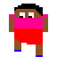
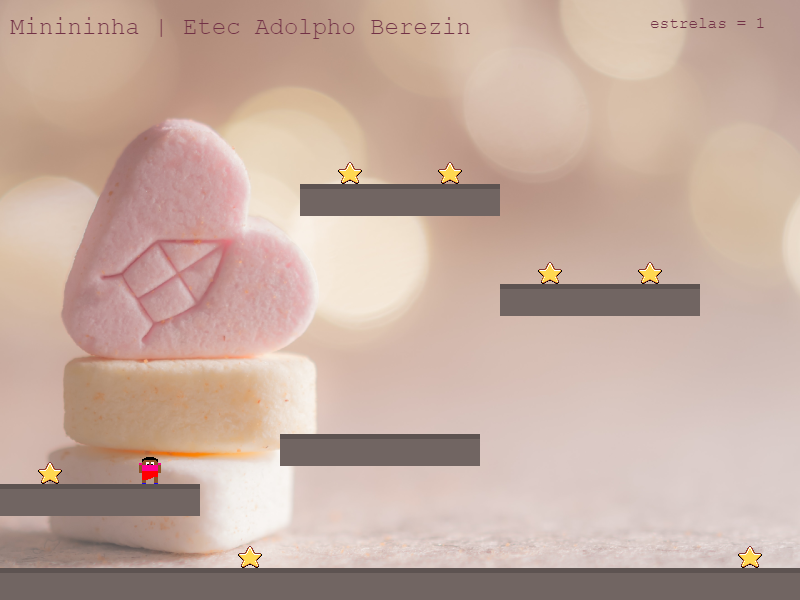

# minininha
Um jogo simples de plataforma 🥰

Implementação do [tutorial básico](http://phaser.io/tutorials/making-your-first-phaser-3-game) do [Phaser 3](http://phaser.io/).

---

[Apenda a programar para a web do zero com o Dev Web](https://github.com/ermogenes/aulas-programacao-web)